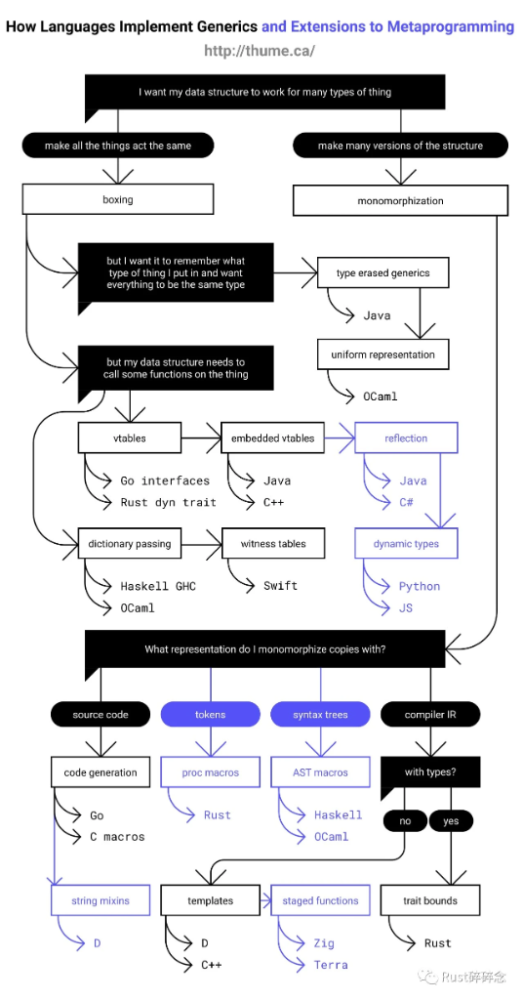

# 编程语言泛型与元编程实现机制深度解析

## 图表概述

这张由 http://humne.ca/ 创建的图表以决策树形式展示了编程语言实现泛型和元编程扩展的不同技术路径和实现机制，清晰呈现了各语言在处理类型抽象时的设计选择和技术演进。

## 泛型实现的两大核心路径

### 1. 让所有事物表现相同 (统一抽象)

**核心思想**：通过类型擦除或运行时抽象，让不同类型以统一方式处理

#### 1.1 装箱 (Boxing)

当需要在保持类型信息的同时进行统一处理时，语言采用装箱技术：

- **虚函数表 (vtables)**

  - **Go 接口**：通过隐式接口实现和动态分派
  - **Rust 的 dyn trait**：显式的动态分派机制，需要手动使用 dyn 关键字
- **嵌入虚函数表**

  - **Java 和 C++**：在对象内部存储类型信息和方法指针

#### 1.2 类型擦除泛型

当需要统一表示但不严格要求保留原始类型信息时：

- **统一表示**
  - **OCaml**：使用运行时类型信息进行动态检查

### 2. 为每种类型创建多个版本 (代码特化)

**核心思想**：通过单态化 (monomorphization) 为每种使用的类型生成专用代码

#### 2.1 字典传递

- **Haskell GHC 和 OCaml**：通过传递类型类字典实现多态
  - 编译时解析，但保留运行时类型信息
  - 实现了参数化多态与特设多态的结合

#### 2.2 见证表

- **Swift**：使用见证表存储类型实现的协议方法
  - 结合了静态类型检查和运行时灵活性

#### 2.3 反射

- **Java 和 C#**：运行时类型信息和动态方法调用
  - 提供最大灵活性，但通常有性能开销
  - 支持运行时类型检查和方法调用

#### 2.4 动态类型

- **Python 和 JavaScript**：完全动态类型系统
  - 运行时才确定类型和方法调用
  - 最大灵活性但最小静态保证

## 元编程扩展的实现路径

### 代码生成阶段选择

图表还展示了不同语言在编译管道的哪个阶段进行元编程：

1. **源代码阶段**

   - **代码生成**：Go、C 宏
   - 基于字符串处理，灵活性低但实现简单
2. **Token 阶段**

   - **过程宏 (proc macros)**：Rust
   - 处理标记流，提供语法扩展能力
   - 允许创建自定义派生特性和函数式宏
3. **语法树阶段**

   - **AST 宏**：Haskell、OCaml
   - 操作抽象语法树，提供更强大的代码转换能力
4. **编译器 IR 阶段**

   - 分为带类型信息和不带类型信息两种路径：

     - **字符串混合**：D 语言
     - **模板**：D、C++
       - 编译时展开，支持复杂的元编程
     - **阶段性函数**：Zig、Terra
       - 将编译时和运行时计算结合
     - **Trait 约束**：Rust
       - 在单态化时应用类型约束

## 主要语言实现对比

### Rust

- **泛型实现**：主要采用单态化，同时支持 dyn trait 的动态分派
- **元编程**：通过 proc macros 在 token 阶段和 trait bounds 在 IR 阶段实现
- **特点**：零成本抽象，编译期优化，强类型安全

### Java

- **泛型实现**：类型擦除，运行时通过反射支持部分动态操作
- **元编程**：主要通过反射机制实现运行时元编程
- **特点**：运行时灵活性，类型擦除导致某些限制

### C++

- **泛型实现**：模板系统，编译期单态化
- **元编程**：强大的模板元编程，在 IR 阶段操作
- **特点**：编译期计算，错误信息复杂，模板膨胀

### Go

- **泛型实现**：接口系统，运行时动态分派
- **元编程**：代码生成，预处理阶段宏有限
- **特点**：简单性优先，编译速度快

### Haskell/OCaml

- **泛型实现**：类型类/模块系统，字典传递
- **元编程**：强大的 AST 宏系统
- **特点**：理论基础坚实，类型系统丰富

## 技术权衡分析

### 单态化 vs 类型擦除

| 实现方式           | 优势                   | 劣势                     | 代表语言      |
| ------------------ | ---------------------- | ------------------------ | ------------- |
| **单态化**   | 运行时性能好，类型安全 | 代码膨胀，编译时间长     | Rust, C++     |
| **类型擦除** | 代码体积小，编译快     | 运行时开销，类型信息丢失 | Java          |
| **动态分派** | 灵活性高，代码精简     | 间接调用开销             | Go, Rust(dyn) |

### 元编程阶段对比

- **早期阶段 (源代码/Token)**：实现简单，但能力有限
- **中期阶段 (AST)**：平衡了灵活性和类型安全
- **晚期阶段 (IR)**：能够利用编译优化，但实现复杂

## 设计哲学与技术演进

这张图表不仅展示了技术实现，也反映了不同语言的设计哲学：

- **性能优先**：Rust、C++ 选择单态化牺牲编译时间换取运行时性能
- **简单性优先**：Go 选择简单的接口系统和有限的元编程
- **表达力优先**：Haskell、OCaml 提供丰富的类型系统和元编程工具
- **平衡路线**：Java、Swift 尝试在性能和灵活性间取得平衡

## 实际应用启示

1. **性能敏感场景**：选择单态化实现的语言 (Rust、C++)
2. **快速开发场景**：选择动态类型或类型擦除的语言 (Python、Java)
3. **元编程需求**：根据复杂度选择合适的工具 (Rust proc macros、C++ templates)
4. **跨语言互操作**：了解各语言泛型实现差异，避免类型系统不匹配问题

## 总结

这张图表通过决策树形式全面展示了编程语言处理泛型和元编程的技术路径，揭示了不同设计选择背后的权衡。从单态化到类型擦除，从源代码宏到编译期模板，每种实现都代表了语言设计者在性能、灵活性、类型安全和表达力之间做出的选择。理解这些差异有助于开发者在不同场景下选择合适的语言，也为语言设计提供了宝贵的参考。


---


# 编程语言特性实现示例详解

## 一、不同语言泛型实现示例

### 1. Rust泛型实现（单态化）

```rust
// 定义泛型结构体
struct Point<T> {
    x: T,
    y: T,
}

// 为泛型类型实现方法
impl<T> Point<T> {
    fn new(x: T, y: T) -> Self {
        Point { x, y }
    }
  
    fn x(&self) -> &T {
        &self.x
    }
}

// 为特定类型实现特化方法
impl Point<f32> {
    fn distance_from_origin(&self) -> f32 {
        (self.x.powi(2) + self.y.powi(2)).sqrt()
    }
}

fn main() {
    // 使用不同类型实例化
    let integer_point = Point::new(5, 10);
    let float_point = Point::new(3.0, 4.0);
  
    println!("Integer x: {}", integer_point.x());
    println!("Float distance: {}", float_point.distance_from_origin());
  
    // 编译时会为i32和f32分别生成专用代码
}
```

**编译原理**：Rust编译器会为 `Point<i32>`和 `Point<f32>`分别生成独立的代码，类似于手动为每种类型编写专门的实现，保证运行时没有类型擦除的开销。

### 2. Java泛型实现（类型擦除）

```java
// 定义泛型类
class Box<T> {
    private T content;
  
    public Box(T content) {
        this.content = content;
    }
  
    public T getContent() {
        return content;
    }
  
    public void setContent(T content) {
        this.content = content;
    }
}

public class Main {
    public static void main(String[] args) {
        // 使用不同类型
        Box<Integer> intBox = new Box<>(10);
        Box<String> strBox = new Box<>("Hello");
      
        // 编译通过但运行时会抛出ClassCastException
        // Box<String> rawBox = (Box<String>)new Box<>(10);
      
        // 泛型信息在运行时被擦除，实际编译为:
        // Box intBox = new Box(10);
        // String content = (String)strBox.getContent();
    }
}
```

**编译原理**：Java编译器将泛型代码编译为原始类型（raw type）代码，运行时类型参数被擦除，仅保留类型转换检查。这就是为什么Java泛型不能用于运行时类型检查。

### 3. Go接口实现（动态分派）

```go
// 定义接口
interface Shape {
    Area() float64
    Perimeter() float64
}

// 实现接口
struct Rectangle {
    width, height float64
}

func (r Rectangle) Area() float64 {
    return r.width * r.height
}

func (r Rectangle) Perimeter() float64 {
    return 2 * (r.width + r.height)
}

struct Circle {
    radius float64
}

func (c Circle) Area() float64 {
    return math.Pi * c.radius * c.radius
}

func (c Circle) Perimeter() float64 {
    return 2 * math.Pi * c.radius
}

// 使用接口
func PrintShapeInfo(s Shape) {
    fmt.Printf("Area: %.2f, Perimeter: %.2f\n", s.Area(), s.Perimeter())
}

func main() {
    rect := Rectangle{width: 5, height: 3}
    circle := Circle{radius: 2.5}
  
    PrintShapeInfo(rect) // 动态分派到Rectangle的方法
    PrintShapeInfo(circle) // 动态分派到Circle的方法
  
    // Go接口是隐式的，且在运行时通过vtable进行动态分派
}
```

**编译原理**：Go接口实现包含一个指向具体数据的指针和一个指向方法表（类似vtable）的指针，在运行时通过查表实现动态分派。

### 4. C++模板实现（编译期特化）

```cpp
#include <iostream>
#include <string>

// 定义模板类
template <typename T>
class Vector {
private:
    T* data;
    size_t size;
    size_t capacity;
public:
    Vector() : data(nullptr), size(0), capacity(0) {}
  
    void push_back(const T& value) {
        // 简化实现，实际需要处理扩容
        if (size == capacity) {
            capacity = capacity == 0 ? 1 : capacity * 2;
            T* new_data = new T[capacity];
            if (data) {
                for (size_t i = 0; i < size; i++) {
                    new_data[i] = data[i];
                }
                delete[] data;
            }
            data = new_data;
        }
        data[size++] = value;
    }
  
    T& operator[](size_t index) {
        return data[index];
    }
  
    // 析构函数等其他必要方法...
};

// 模板特化
template <>
class Vector<bool> {
    // 特化实现，可以使用位压缩优化空间
};

int main() {
    Vector<int> intVector;
    Vector<std::string> stringVector;
  
    intVector.push_back(42);
    stringVector.push_back("Hello");
  
    // 编译时为int和std::string分别生成专用代码
}
```

**编译原理**：C++模板在编译时完全展开，为每个类型参数生成专用代码。支持模板特化，可以为特定类型提供定制实现。

## 二、Rust Option类型使用示例

### 1. 基本使用

```rust
// Option的基本定义（标准库中已定义）
enum Option<T> {
    None,
    Some(T),
}

fn divide(numerator: f64, denominator: f64) -> Option<f64> {
    if denominator == 0.0 {
        None
    } else {
        Some(numerator / denominator)
    }
}

fn main() {
    // 方式1: match表达式
    match divide(10.0, 2.0) {
        Some(result) => println!("Result: {}", result),
        None => println!("Cannot divide by zero"),
    }
  
    // 方式2: if let
    if let Some(result) = divide(10.0, 0.0) {
        println!("Result: {}", result);
    } else {
        println!("Cannot divide by zero");
    }
}
```

### 2. Option组合子方法链

```rust
fn get_user_id(username: &str) -> Option<u32> {
    match username {
        "admin" => Some(1),
        "user1" => Some(2),
        _ => None,
    }
}

fn get_user_role(user_id: u32) -> Option<String> {
    match user_id {
        1 => Some("Administrator".to_string()),
        2 => Some("User".to_string()),
        _ => None,
    }
}

fn can_access_admin_panel(role: &str) -> bool {
    role == "Administrator"
}

fn main() {
    // 组合子链式调用
    let can_access = get_user_id("admin")
        .and_then(get_user_role)
        .map(|role| can_access_admin_panel(&role))
        .unwrap_or(false);
  
    println!("Can access admin panel: {}", can_access);
  
    // 使用map_or提供默认值
    let display_name = get_user_id("unknown")
        .and_then(get_user_role)
        .map_or_else(
            || "Guest".to_string(),
            |role| format!("User ({}))", role)
        );
  
    println!("Display name: {}", display_name);
  
    // 使用get_or_insert
    let mut maybe_name = None;
    let name = maybe_name.get_or_insert("Default Name");
    *name = "Updated Name"; // 通过可变引用修改
    println!("Name: {:?}", maybe_name); // Some("Updated Name")
}
```

### 3. 实际应用案例：链表实现

```rust
// 链表节点定义
struct Node<T> {
    value: T,
    next: Option<Box<Node<T>>>,
}

// 链表定义
struct LinkedList<T> {
    head: Option<Box<Node<T>>>,
    size: usize,
}

impl<T> LinkedList<T> {
    fn new() -> Self {
        LinkedList { head: None, size: 0 }
    }
  
    // 添加到链表头部
    fn push(&mut self, value: T) {
        let new_node = Box::new(Node {
            value,
            next: self.head.take(), // 取出原head并设为None
        });
        self.head = Some(new_node);
        self.size += 1;
    }
  
    // 从头部弹出
    fn pop(&mut self) -> Option<T> {
        self.head.take().map(|node| {
            self.head = node.next;
            self.size -= 1;
            node.value
        })
    }
  
    // 获取头部值（不弹出）
    fn peek(&self) -> Option<&T> {
        self.head.as_ref().map(|node| &node.value)
    }
  
    // 获取可变头部值
    fn peek_mut(&mut self) -> Option<&mut T> {
        self.head.as_mut().map(|node| &mut node.value)
    }
}

fn main() {
    let mut list = LinkedList::new();
  
    // 添加元素
    list.push(1);
    list.push(2);
    list.push(3);
  
    // 查看头部
    if let Some(value) = list.peek() {
        println!("Head: {}", value);
    }
  
    // 修改头部
    if let Some(value) = list.peek_mut() {
        *value = 10;
    }
  
    // 弹出所有元素
    while let Some(value) = list.pop() {
        println!("Popped: {}", value);
    }
  
    // 确认链表为空
    println!("Is empty: {}", list.peek().is_none());
}
```

### 4. Option与Result配合使用

```rust
use std::fs::File;
use std::io::{self, Read};

fn read_file_content(path: &str) -> Result<String, io::Error> {
    // ?操作符自动处理Result
    let mut file = File::open(path)?;
    let mut content = String::new();
    file.read_to_string(&mut content)?;
    Ok(content)
}

fn find_user_by_id(id: u32, file_path: &str) -> Result<Option<String>, io::Error> {
    // 读取用户数据库
    let content = read_file_content(file_path)?;
  
    // 模拟解析JSON或其他格式
    // 这里简化处理，假设返回None或Some用户名
    if id < 1000 {
        Ok(Some(format!("User{}_from_file", id)))
    } else {
        Ok(None) // 用户不存在
    }
}

fn main() {
    match find_user_by_id(42, "users.txt") {
        Ok(Some(username)) => println!("Found user: {}", username),
        Ok(None) => println!("User not found"),
        Err(e) => println!("Error reading file: {}", e),
    }
  
    // 使用组合子方法
    let result = find_user_by_id(42, "users.txt")
        .and_then(|opt| opt.ok_or_else(|| io::Error::new(io::ErrorKind::NotFound, "User not found")))
        .map(|username| format!("Welcome, {}", username));
  
    println!("Result: {:?}", result);
}
```

## 三、元编程实现示例

### 1. Rust过程宏示例

```rust
// 需要在Cargo.toml中添加:
// [lib]
// proc-macro = true

use proc_macro::TokenStream;
use quote::quote;
use syn::{parse_macro_input, DeriveInput};

// 自定义派生宏
#[proc_macro_derive(HelloMacro)]
pub fn hello_macro_derive(input: TokenStream) -> TokenStream {
    // 解析输入的Rust代码为语法树
    let ast = parse_macro_input!(input as DeriveInput);
  
    // 获取类型名称
    let name = &ast.ident;
  
    // 生成实现代码
    let gen = quote! {
        impl HelloMacro for #name {
            fn hello_macro() {
                println!("Hello, Macro! My name is {}.", stringify!(#name));
            }
        }
    };
  
    // 将生成的代码转换回TokenStream
    gen.into()
}

// 使用示例（在另一个crate中）:
/*
use hello_macro::HelloMacro;

#[derive(HelloMacro)]
struct Pancakes;

fn main() {
    Pancakes::hello_macro(); // 输出: Hello, Macro! My name is Pancakes.
}
*/
```

### 2. C++模板元编程示例

```cpp
#include <iostream>

// 编译期计算阶乘的元函数
template <int N>
struct Factorial {
    static constexpr int value = N * Factorial<N-1>::value;
};

// 特化终止条件
template <>
struct Factorial<0> {
    static constexpr int value = 1;
};

// 编译期判断素数
template <int N, int D = 2>
struct IsPrime {
    static constexpr bool value = (D * D > N) ? true : 
                                 (N % D == 0) ? false : 
                                 IsPrime<N, D + 1>::value;
};

// 特化终止条件
template <int N>
struct IsPrime<N, 0> {
    static constexpr bool value = false;
};

template <int N>
struct IsPrime<N, 1> {
    static constexpr bool value = false;
};

template <>
struct IsPrime<2, 2> {
    static constexpr bool value = true;
};

int main() {
    // 编译期计算，运行时直接使用结果
    constexpr int fact5 = Factorial<5>::value;
    std::cout << "5! = " << fact5 << std::endl; // 120
  
    // 编译期判断素数
    constexpr bool is_prime_7 = IsPrime<7>::value;
    constexpr bool is_prime_9 = IsPrime<9>::value;
    std::cout << "7 is prime: " << is_prime_7 << std::endl; // true
    std::cout << "9 is prime: " << is_prime_9 << std::endl; // false
  
    return 0;
}
```

## 总结

以上示例展示了不同编程语言中泛型、Option类型和元编程的具体实现方式：

1. **泛型实现差异**：

   - Rust和C++使用单态化，为每种类型生成专用代码，性能最佳但可能导致代码膨胀
   - Java使用类型擦除，编译后泛型信息丢失，运行时通过类型转换保证安全
   - Go通过接口实现动态分派，运行时查表调用方法
2. **Option类型应用**：

   - 通过枚举表示可能为空的值，避免空指针异常
   - 提供丰富的组合子方法进行链式操作
   - 在数据结构实现中广泛应用，如链表、树等
3. **元编程技术**：

   - Rust过程宏在Token层面操作代码，提供强大的元编程能力
   - C++模板元编程在编译期进行计算和代码生成

这些技术选择反映了不同语言的设计哲学，开发者可以根据具体需求和场景选择合适的语言和实现方式。
